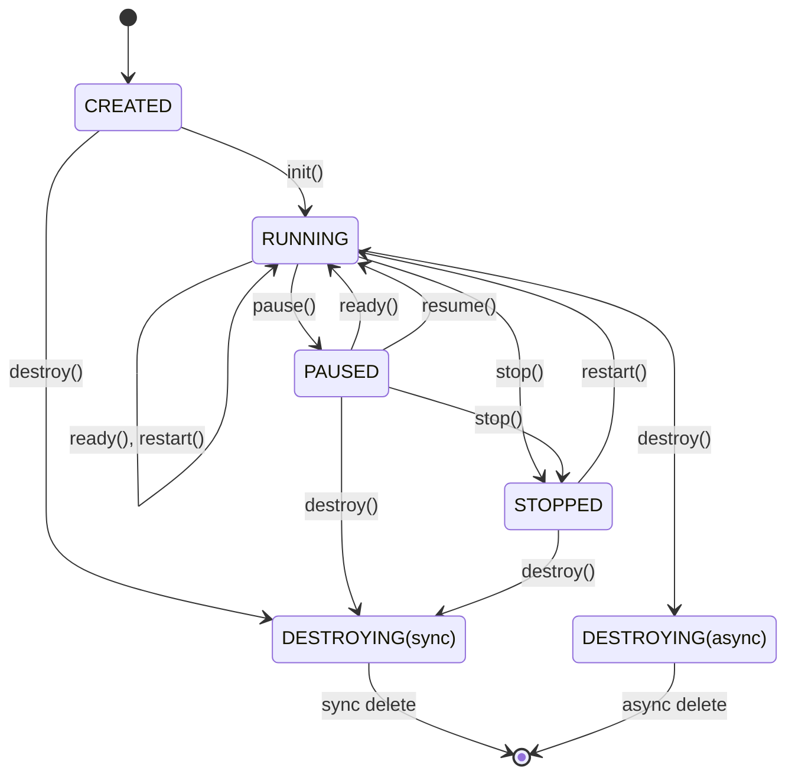

# gm_timer

- 该模块是基于 POSIX 定时器接口实现的通用定时器。
- 使用 `SIGEV_THREAD` 方式触发定时任务，回调函数运行在独立线程中。
- 定时器在生命周期结束时会自动完成资源释放，无需用户显式销毁。
- 定时器采用串行触发机制，确保同一定时器的回调函数不会发生并发或重入。

## 目录结构

```bash
gm_timer/
├── build/             # 编译输出目录
├── CMakeLists.txt
├── examples/          # 示例代码
│   ├── CMakeLists.txt
│   └── gm_timer.c
├── gm_timer/          # 模块核心源码
│   ├── CMakeLists.txt
│   ├── gm_timer.c
│   └── gm_timer.h
├── LICENSE
└── README.md
```

## 状态说明

### 状态定义

```c
// 定时器状态
typedef enum _gm_timer_status
{
    E_GM_TIMER_STATUS_NONE,       // 未创建
    E_GM_TIMER_STATUS_CREATED,    // 已创建但未启动
    E_GM_TIMER_STATUS_RUNNING,    // 运行中
    E_GM_TIMER_STATUS_PAUSED,     // 已暂停
    E_GM_TIMER_STATUS_STOPPED,    // 已停止（重复次数用完后进入该状态)
    E_GM_TIMER_STATUS_DESTROYING, // 销毁中
} gm_timer_status_e;
```

### 状态表格

| 当前状态   | 操作      | 下一状态         | 备注                     |
| ---------- | --------- | ---------------- | ------------------------ |
| CREATED    | init()    | RUNNING          | 初始化后直接启动         |
| CREATED    | destroy() | DESTROYING       | 同步销毁                 |
| RUNNING    | ready()   | RUNNING          | 立即执行                 |
| RUNNING    | pause()   | PAUSED           | 暂停定时器               |
| RUNNING    | stop()    | STOPPED          | 停止定时器，不释放资源   |
| RUNNING    | restart() | RUNNING          | 重启定时器               |
| RUNNING    | destroy() | DESTROYING       | 异步销毁                 |
| PAUSED     | ready()   | RUNNING          | 立即执行                 |
| PAUSED     | resume()  | RUNNING          | 恢复定时器               |
| PAUSED     | stop()    | STOPPED          | 停止定时器               |
| PAUSED     | destroy() | DESTROYING       | 同步销毁                 |
| STOPPED    | restart() | RUNNING          | 重置 repeat_count 并启动 |
| STOPPED    | destroy() | DESTROYING       | 同步销毁                 |
| DESTROYING | -         | -                | 异步销毁中，不可操作     |

### 状态转移图



## 编译与运行

### 编译

```bash
$ mkdir build
$ cd build
$ cmake ..
$ make
```

编译完成后，`build` 目录结构如下（仅说明关键文件）：

``` bash
build/
├── examples/
│   ├── example_basic        # 有限次数循环示例
│   ├── example_forever      # 无限循环示例
│   ├── example_multi        # 多定时器示例
│   ├── example_pause_resume # 暂停&恢复示例
│   ├── example_ready        # 就绪/立即执行示例
│   └── example_stop_restart # 停止&重启示例
└── gm_timer/
    └── libgm_timer.a        # 静态库
```

### 运行示例

```bash
$ cd build/examples
$ sudo ./example_basic
```

## 移植

### 方式一：使用源码

将 `gm_timer` 目录下的源码文件复制到你的项目目录中，并在代码中包含 `gm_timer.h` 头文件。
可参考 `gm_timer/CMakeLists.txt` 中的写法，将其作为一个独立模块进行编译。

### 方式二：使用静态库

将生成的 `libgm_timer.a` 和 `gm_timer.h` 拷贝到你的项目中，包含 `gm_timer.h` 头文件并链接 `libgm_timer.a` 库即可。

## 注意事项

- 接口行为及返回值请以头文件注释为准

## 问题与建议

有任何问题或建议欢迎提交 [issue](https://github.com/general-modules/gm_timer/issues) 进行讨论。
